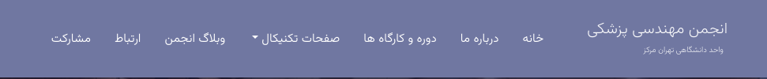

### Official platform of Biomedical Organization Of Central Tehran Azad University 



---

## Important parts:

- Research and articles: https://cabea.ir/research/
- Articles forum: https://cabea.ir/blog/
- Professors: https://cabea.ir/teacher/
- System participation: https://cabea.ir/scholarship/
- Podcast: https://cabea.ir/podcast/
- Journal: https://cabea.ir/magazine/

What is Medical-Engineering-Association Core?
---------------------
[](https://github.com/Mehranalam/Medical-Engineering-Association/actions/workflows/hugo.yml)

From now on, the Medical Engineering Association of Azad University, Tehran branch, has an independent platform to communicate with students, as well as the convenience of dear students to regularly receive academic information. 

The website is in the early stages of development. As a result, we ask you, dear servers, if you have any ideas - suggestions, as well as criticisms on the functioning of the website, please contact us using the contact page with the forum or email so that we can develop this platform as best as possible. 

Also, if you are a developer and a technical person, all of this source The codes of this website are freely available to the public, you can apply appropriate changes by referring to Github. All change requests are reviewed.

### License

Medical-Engineering-Association this  Core is released under the terms of the ```MIT license```. for more
information or see https://opensource.org/licenses/MIT.

### Development Process

The `main` branch is regularly built (see `Content-participation.md` for instructions) and tested, but it is not guaranteed to be completely stable. [Tags](https://github.com/mehranalam/Medical-Engineering-Association/tags) are created regularly from release branches to indicate new official, stable release versions of Bitcoin Core.


The https://github.com/mehranalam/Medical-Engineering-Association repository is used exclusively for the
development of the GUI. Its master branch is identical in all monotree
repositories. Release branches and tags do not exist, so please do not fork
that repository unless it is for development reasons.

`Medical-Engineering-Association Copyright (C) 2023  Mehran Alam Beigi`


**The contribution workflow is described in [CONTRIBUTING.md](Content-participation.md).**

<!-- ### contributors 

<!--
      <h3 align="right" dir="rtl">مشارکت کنندگان</h3>
      <div class="col-lg-7 mb-4 mb-lg-0" dir="rtl">
        <form action="{{ site.Params.contact_form_action | safeURL }}" method="POST">
          <input type="text" class="form-control mb-3" id="name" name="name" placeholder="نام">
          <input type="email" class="form-control mb-3" id="mail" name="mail" placeholder="ایمیل">
          <input type="text" class="form-control mb-3" id="subject" name="subject" placeholder="موضوع">
          <textarea name="message" id="message" class="form-control mb-3" placeholder="پیامتون"></textarea>
          <button type="submit" value="send" class="btn btn-primary">{{ i18n "send" }}</button>
        </form>
      </div>
-->
