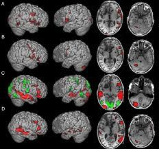
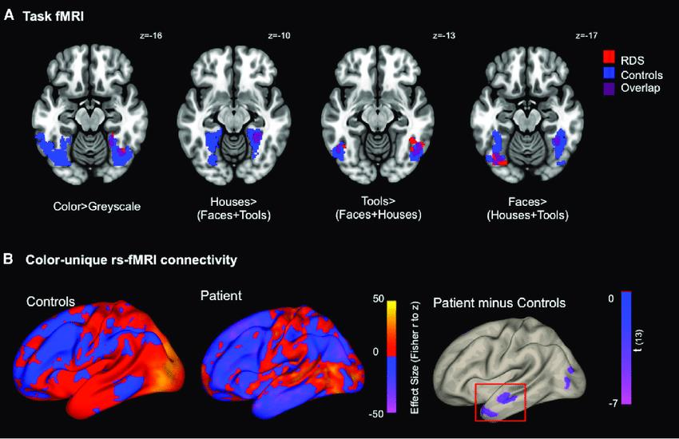
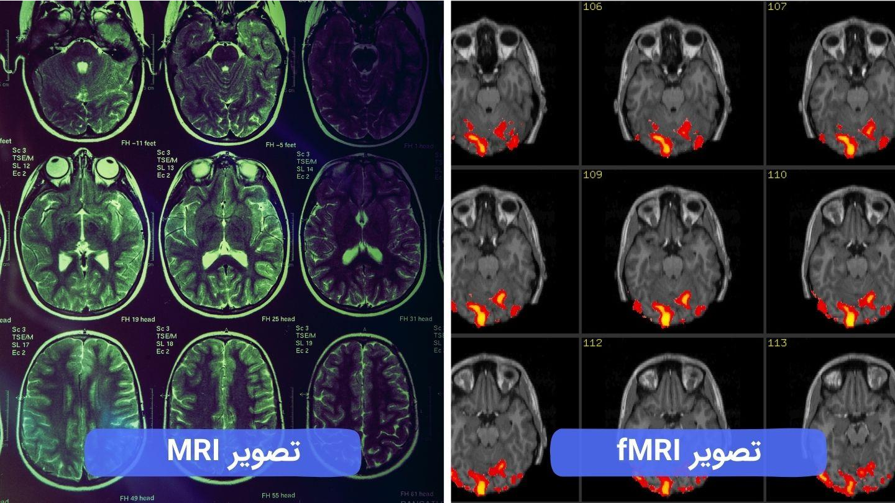
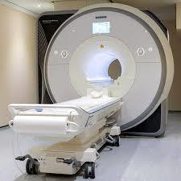
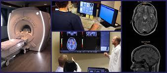

>  style="width:6.49986in;height:6.93958in" />**fMRI** (Functional
> magnetic
>
> resonance imaging)
>
> یسیطانغم سنانوزر یرادربریوصت یدرکلمع
>
> **ییوجشناد** **یشهوژپ** **هلاقم**
>
> یمیرکزانلا:ققحم
>
> **بلاطم** **تسرهف**
>
> <u>**fMRI** یفرعم و همدقم</u> • <u>درکراک هوحن</u>
> • <u>**MRI**و**fMRI**توافت</u> • <u>درباک و هدافتسا دراوم</u>
> • <u>**fMRI**ماجنا هوحن</u> • <u>**fMRI**ضراوع</u> •
>
> **:یفرعم** **و** **همدقم**

**یآ** **رآ** **ماایلانشکناف** **یآ** **رآ** **ماففخم** **(fMRI)**
**یآ** **رآ** **ما** **فا** **،(Functional** **magnetic** **resonance**
**imaging)** **یدرکلمع** **هک** **تسازغم** **زا** **یمجاهتریغ**
**یرادربریوصت** **هتفرشیپیروانف** **یعون** **صیخشت** **نوخ** **نایرج**
**رد** **تارییغت** **یریگهزادنا** **اب** **ار** **زغم** **تیلاعف**
**.دهدیم**

**یرامیب** **رب** **تراظنزا** **،یفلتخم** **فادها** **یارب** **ناوتیم**
**ارfMRI** **نکسا** **،زغم** **ردصاخ** **وراد** **کیدرکلمع** **هوحن**
**هدهاشم** **ات** **نوسنیکراپ** **یارب** **تاعلاطا** **نیا** **زا**
**دنناوتیم** **ناکشزپ** **و** **ناققحم** **.درک** **هدافتسا**
**هدافتسا** **فلتخم** **طیارش** **نامرد** **و** **تراظن** **،صیخشت**
**،رتهب** **کرد** **.دننک**

> **؟** **دنکیم** **راک** **هنوگچ** **و** **تسیچfmri**

**هب** **نیبولگومه** **طسوت** **نژیسکا** **،ناسنا** **ندب** **یاهلولس**
**راتخاس** **رد** **نژیسکا** **یارب** **اضاقت** **،ینورون** **تیلاعف**
**شیازفا** **اب.دسر** **یماه** **نورون** **لااب** **اهنورون** **تیلاعف**
**لحم** **رد** **نوخ** **نایرج** **هجیتنرد** **و** **هدش** **رتشیب**
**یاراد** **،نژیسکا** **یواح** **،نیبولگومه** **هک** **نآ** **لیلد**
**هب** **.دور** **یم** **لانگیس** **رد** **کچوک** **توافت** **داجیا**
**ثعاب** **تسا** **یسیطانغم** **تیصاخ** **تفگ** **ناوت** **یم** **ساسا**
**نیا** **رب** **.دوشیم** **(MR)** **یسیطانغم** **دیدشت** **رییغت**
**ینورون** **تیلاعف** **حطس** **اب** **بسانتم** **نوخ** **نژیسکا**
**نازیم** **هک** **ناوت** **یم** **نآ** **زا** **لصاح** **تارییغت**
**و** **هدش** **حرطم** **یگژیو** **زا** **.دنک** **یم** **.دومن**
**هدافتسا** **یزغم** **تیلاعف** **تبث** **یارب**

>  style="width:0.24132in;height:0.38889in" />[**دینک**
> **کیلکfMRIدرکراک** **هوحن** **ویدیو** **ندید**
> **یارب**](https://www.digikala.com/mag/video/how-mri-works/)
>
> **:fMRIوMRIتوافت**

**هیهت** **اهنآ** **راتخاسزایریواصت** **افرص** **،اهمادنا** **ریاس**
**ای** **زغم** **یآ** **رآ** **ما** **هئارا** **اهنآ** **تیلاعف** **و**
**درکلمع** **زا** **یقیقد** **تاعلاطا** **دناوتیمن** **و** **دنکیم**
**یاههکبش** **زا** **یرادربهشقن،یآ** **رآ** **ما** **فا** **عادبا**
**اب** **هکیلاحرد** **.دهد** **یاهدرکلمع** **هنوگچ** **زغم** **هک**
**هلئسم** **نیا** **هدهاشم** **وزغم** **یبصع** **ساسحا** **،تکرح**
**،یریگدای** **،یفطاع** **یاهخساپ** **،رکفت** **دننام** **یتایح**
**.دش** **مهارف** **ناققحم** **یارب** **،دنکیم** **لرتنک** **ار**
**راتفگ** **ای**

**هتکس** **تارثاات** **دنک** **کمک** **ناکشزپ** **هب** **دناوتیم**
**رآ** **ما** **فا** **نکسا** **دنراذگیم** **ریثأت** **عاخن** **ایزغم**
**رب** **هک** **ییاهیرامیب** **ریاساییزغم** **نینچمه** **.دننک**
**یبایزرا** **ار** **)نوسنیکراپ** **و** **رمیازلآ** **،عرص(**
**یاهکینکت** **ریاس** **اب** **هکیراتخاس** **یاهیراجنهان** **صیخشت**
**یارب** **.دوشیم** **هدافتسا** **،دنتسین** **صیخشتلباق**
**یرادربریوصت** **نیرترثوم** **ات** **دنکیم** **کمک** **کشزپهب** **شور**
**نیا** **زا** **لصاح** **یاههداد** **یباختنا** **نامرد** **کی** **هک**
**دنک** **یبایزرا** **ای** **دنک** **نییعت** **ار** **نامرد** **شور**
**.دنکیم** **راک** **بوخ** **ردقچ** **یحارج** **دننام**

> **زکرم** **ییاسانش** **یارب** **هار** **اهنت** **،یآ** **رآ** **ما**
> **فا** **عارتخا** **زا** **لبق** **شور** **کی** **یط** **رد** **زغم**
> **کیرحت** **،زغم** **ینابز** **ای** **یتکرح** **یاهتراهم** **نونکا**
> **،fMRI** **اب** **هناتخبشوخ** **.دوب** **یحارج** **دننام** **یمجاهت**
> **تیلاعف** **هدهاشم** **یارب** **یمجاهتریغ** **ودرد** **نودب**
> **نمیایراکهار** **.میراد** **زغم**
>
> **نادیم** **کی** **زا** **یلومعم** **یآ** **رآ** **مادننامیآ** **رآ**
> **ما** **فاهچرگا** **ریواصت** **دیلوت** **یارب** **ییویدار**
> **یاهجوم** **و** **دنمتردق** **یسیطانغم** **دوجو** **شور** **ود**
> **نیا** **نیبیمهم** **یاهتوافت** **اما** **،دنکیم** **هدافتسا**
> **.دراد**
>
> **،دریگیم** **سکع** **امش** **زغم** **راتخاس** **زا** **یلومعم**
> **یآ** **رآ** **ما** **هکینامز** **ریاس** **ویزیرنوخ،یدوبک،اهروموت**
> **،اهتسیکدناوتیم**
>
> **رآ** **ما** **فاهکیلاحرد** **.دهد** **ناشن** **ار** **زغم**
> **یراتخاس** **یاهیراجنهان** **دناوتیم** **،دهدیم** **ماجنا** **ار**
> **یصاخ** **درکلمع** **امش** **زغم** **هکینامزیآ** **.دنک** **داجیا**
> **زغم** **ریواصت** **یلااب** **رد** **یدرکلمع** **هشقن** **کی**

**هتساوخ** **امش** **زا** **تسا** **نکمم** **،fMRI** **نکسالوط** **رد**
**لیلدنیمههب** **هملک** **کی** **هب** **ندرک** **رکف** **ای** **وزاب**
**ندرک** **دنلب** **دننام** **یراک** **هک** **دوش** **رآ** **ماات**
**دننکیملاعف** **ار** **امش** **زغم** **اهراک** **نیا** **.دیهد**
**ماجنا** **ار** **صاخ** **ار** **امش** **زغم** **فلتخم** **یاهشخب**
**تیلاعف** **دناوتبیدرکلمع** **یآ**

> **مزلا** **زغم** **یلومعم** **یآ** **رآ** **ما** **یط** **رد**
> **هکیلاحرد** **.دنک** **یریگهزادنا** **.دیشکب** **زارد** **رنکسا**
> **هاگتسد** **ریزرد** **تکرحیب** **تسا**
>
> **روط** **هب** **لانشکناف** **یآ** **رآ** **ما** **هک** **تسا**
> **هدش** **صخشم** **رد** **تارییغتصیخشت** **اب** **ارزغم** **یکیرتکلا**
> **تیلاعفمیقتسمریغ**

**اهنورون** **هکیماگنه** **اریز** **.دنکیم** **یریگهزادنانوخ**
**نژیسکا** **حطس** **نوخ** **زمرق** **یاهلوبلگ** **زا** **یرتشیب**
**نژیسکاهب** **،دنوشیم** **رتلاعف** **دکابfMRI** **ریواصت** **رد**
**تیلاعف** **زا** **نازیم** **نیا** **.دنراد** **زاین**

> **.** **دوشیم** **صخشمیگنر**
>
> **fMRI،1ریوصت**

**ابندب** **نژوردیه** **یاهلوکلوم** **ادتبا** **،** **MRIماجنا**
**نامز** **رد** **.دنوشیم** **وسمه** **هاگتسد** **طسوت** **هدشداجیا**
**یسیطانغم** **یاهنادیم** **یاههتسه** **طسوتیژرناناونعهب** **هدشدازآ**
**ییویدار** **جاوما** **سپس** **اههتسه** **،ییویدار** **جاوما**
**دیلوت** **فقوت** **اب** **.دنوشیم** **بذج** **نژوردیه** **یکچوک**
**یژرنا** **یاهلانگیس** **و** **دندرگیمزاب** **دوخ** **زارت** **تلاح**
**هب** **لیدبت** **ریواصت** **هب** **رتویپماک** **طسوت** **اهلانگیس**
**نیا** **.دننکیم** **رشتنم** **.دنوشیم**

> **یبصع** **تیلاعف** **رد** **تارییغت** **ساسارب** **زغم** **راتفرزا**
> **یدهاوشfMRI** **یناسنا** **یاهتیلاعف** **مامت** **لوط** **رد**
> **زغم** **زا** **تمسق** **دنچ** **ای** **کی** **رد** **هک**
>
> **ار** **زغم** **یکیرتکلا** **تیلاعف** **،عقاو** **رد** **.دنکیم**
> **تبث** **،دهدیمخر** **یاهلولس** **نوخ** **نژیسکانازیم** **رد**
> **تارییغت** **صیخشت** **اب** **رتلاعف** **اهنورون** **هکیماگنه**
> **اریز** **.دنکیم** **یریگهزادنایبصع** **.دنراد** **زاین** **یرتشیب**
> **نژیسکا** **هب** **،دنوشیم**

> **حوضو** **ویژولونکت** **رظن** **زاfMRI** **وMRI** **توافت**
> **،ناققحم** **رظن** **زا** **.درک** **راکنا** **ناوتیمن** **اررآ**
> **ما** **فا** **ریواصت** **رتلااب**
>
> **MRIوfMRIتوافت،2ریوصت**
>
> **:یآ** **رآ** **ما** **فا** **یاهدربراک**
>
> **یارب** **یصیخشت** **شور** **کی** **یآرآمافا** **دش** **هتفگ** **هک**
> **روطنامه** **ای** **رامیب** **،ملاس** **یاه** **شخبهدهاشم** **و**
> **زغم** **درکراکهوحن** **یسررب**

**یارب** **هوقلاب** **کسیر** **،یآ** **رآ** **ما** **فا** **جیاتن**
**ساسارب.تسا** **هدید** **بیسآ** **.دوش** **یم** **یبایزرا** **زغم**
**یارب** **یمجاهتنامرد** **عونره** **ای** **یحارج** **لمع** **:دوش**
**یمهدافتساریز** **دراومرد** **یآ** **رآ** **ما** **فا** **زا**

> **(Brain)زغم** **یدرکلمع** **یموتانآ** **یسررب** • **و** **رکفت**
> **لثم** **یتایح** **یاهدرکلمع** **هک** **زغم** **زا** **ییاه** **شخب**
> **صیخشت** •

**دننکیم** **هرادا** **ار** **ندرک** **تبحص** **دننام(** **یبیرخت**
**یاهیرامیب** **ای** **هبرض** **،هتکس** **تارثا** **یسررب** **هب**
**کمک** •

> **)رمیازلآ** **یمجاهت** **یاهنامرد** **ای** **و** **ینامردوترپ**
> **،یحارج** **یارب** **ییامنهار** •
>
> **زغم** **رد** **رگید** **(Brain** **mapping)زغم** **یرادرب** **هشقن**
> •
>
> **زغم** **یاهروموت** **درکلمع** **و** **دشر** **نتشاد** **رظن**
> **تحت** •
>
> **یزغم** **یاهیرامیب** **اییراجنهان** **صیخشت** •

**دنتسه** **مهم** **یاهدرکلمع** **لوئسمزغم** **قطانم** **مادک**
**هکنیا** **هدهاشم** •

> **هبرض،عرصدننام** **اهبیسآ** **و** **اهیرامیب** **یتخانش** **تارثا**
> **یبایزرا** • **ناطرس** **اییزغم**
>
> **اهوراد** **یشخبرثا** **نازیم** **نییعت** •
>
> **دیدج** **یاهوراد** **دیلوت** **هب** **کمک** •
>
> **یزغم** **تلالاتخا** **کرد** •
>
> **زغم** **رد** **تارطاخ** **یریگلکش** **یگنوگچ** **یسررب** •
>
> **،رکفت** **دننام** **یتایح** **یاهدرکلمع** **هنوگچزغم** **هکنیا**
> **هدهاشم** • **لرتنک** **ار** **راتفگ** **ای** **ساسحا** **،تکرح**
> **،یریگدای** **،یفطاع** **یاهخساپ**
>
> **)زغم** **یرادربهشقن(** **دنکیم**
>
> **یزغم** **یرامیب** **عاونایتسیز** **یاهرگناشن** **یبایدر** •
>
> **نامرددنور** **رب** **تراظن** •
>
> **ریز** **یاهیرامیب** **صیخشت** **یاربیآ** **رآ** **ما** **فازا**
> **تسا** **نکمم** **نینچمه** **:دوش** **هدافتسا**
>
> **یزغم** **هبرض** **زا** **سپ** **مردنس** •
>
> **ینرفوزیکسا** **دننام** **،یناور** **یاهیرامیب** •
>
> **نوسنیکراپ** **یرامیب** **و** **رمیازلآ** **یرامیب** **دننام**
> **،یبصع** **طیارش** •
>
> **یزغم** **یاهروموت** •
>
> **دردرس** **عاونا** •
>
> **هوحن** **هعلاطم** **یارب** **،یدرکلمع** **یآ** **رآ** **ما** **زا**
> **ناققحم** **هک** **تسا** **رکذ** **لباق** **تیعضو** **اهدعب**
> **دنناوتب** **ات** **دننکیم** **هدافتسا** **زین** **ملاس** **یاهزغم**
> **درکلمع** **.دننک** **یبایزرا** **فلتخم** **طیارش** **رد** **ار**
> **زغم**
>
> **؟دتفایم** **یتاقافتا** **هچ** **شیامزآ** **لوط** **رد**

**هب** **هک** **تسا** **حطسم** **تخت** **کی** **لماش** **،لانشکناف**
**یآ** **رآ** **مارنکسا** **هاگتسد** **یابرنهآ** **کی** **طسوت** **هک**
**گرزب** **لکشیاهناوتسا** **هلول** **کی** **لخاد**

> **،شور** **نیا** **ماجنا** **زا** **لبق** **.دزغلیم** **تسا** **هدش**
> **هطاحا** **لکشیاهریاد** **لرتنک** **یارب** **و** **دیشکب** **زارد**
> **تخت** **یور** **هک** **دنکیم** **کمک** **امش** **هب** **نیسنکت**
>
> **ریگشوگ** **کی** **امش** **هب** **،هاگتسد** **طسوت** **هدشدیلوت**
> **دننامکیلک** **یاهادص** **.دهدیم**
>
> **تسد** **ندرشف** **دننام** **یتاروتسد** **امش** **هب** **،یآ** **رآ**
> **ما** **فا** **نکسا** **لوط** **رد** **رب** **اهتیلاعف** **نیا**
> **اریز** **.دوشیم** **هداد** **صاخ** **تاملک** **هب** **ندرک** **رکف**
> **ای** **تسار**

**ات** **دنهدیم** **هزاجا** **تسیژولویدار** **هب** **و** **دناهدش**
**یراذگدک** **زغم** **ریواصت** **یور** **.دنیبب** **ار** **امش** **زغم**
**تیلاعف** **هشقن**

> **.دشکیم** **لوط** **هقیقد60** **ات40** **نیب** **شیامزآ** **نیا**
> **لاومعم**
>
> **ناکشزپ** **هب** **دارفا** **زغم** **راتخاس** **دروم** **رد** **ار**
> **یرتشیب** **تاعلاطا** **نکسا** **نیا** **نیا** **رگید** **تبثم**
> **هتکن** **.دنک** **یریگولج** **یدج** **تامدص** **زا** **ات**
> **دهدیم** **هئارا** **رایسب** **حوضو** **fMRI** **نکسا** **طسوت**
> **هدشدیلوت** **ریوصت** **هک** **تسا** **.درادییلااب**

> **fMRIهاگتسد،3ریوصت**
>
> **؟تسیچ** **یآ** **رآ** **ما** **فا** **ضراوع**
>
> **یلیخ** **یلومعم** **یآ** **رآ** **ما** **ضراوع** **هباشم** **یآ**
> **رآ** **ما** **فا** **ضراوع** **.دنتسین** **هدننکنارگن**
>
> **رد.** **دوشیمنهدافتسا** **سکیا** **هعشا** **کانرطخ** **جاوما**
> **زا** **شور** **ود** **ره** **رد** **ار** **شور** **نیا** **ماجنا**
> **امش** **یتملاس** **تیعضو** **هب** **هجوت** **اب** **کشزپرگا**
> **،عقاو**

**و** **نتسهیمجاهتریغ** **و** **درد** **نودب** **،نمیا** **اتبسن**
**یشور** **،تسناد** **یرورض** **رطخ** **چیه** **،دشاب** **هتشادن**
**یکینورتکلا** **اییزلف** **تنلپمیارامیب** **هکینامز** **ات** **.درادن**
**دوجونآ** **اب** **طابترا** **رد** **یاهدش** **هتخانش** **یتملاس**

> **بجاح** **هدام** **زا** **یدرکلمع** **یآرآ** **ما** **رد**
> **هکییاجنآزا** **هتبلا** **تلاکشم** **ای** **کیژرلآ** **شنکاو**
> **زورب** **رطخ** **نآ** **ماجنا** **اب** **،دوشیمن** **هدافتسا**
>
> **.دنکیمن** **دیدهت** **ار** **امش** **یویلک**
>
> **دناوتب** **رگا** **اما** **،تساتمیقنارگشور** **کی** **یآ** **رآ**
> **ما** **فا** **نکسا** **هچرگا** **ار** **نداد** **ماجنا** **شزرا**
> **،دوش** **زغم** **رد** **یرورض** **درکلمع** **کی** **فذح** **زا**
> **عنام** **.دراد**

> **fMRI** **رد** **زغم** **ییاراک** **ریوصت** **،4ریوصت**
